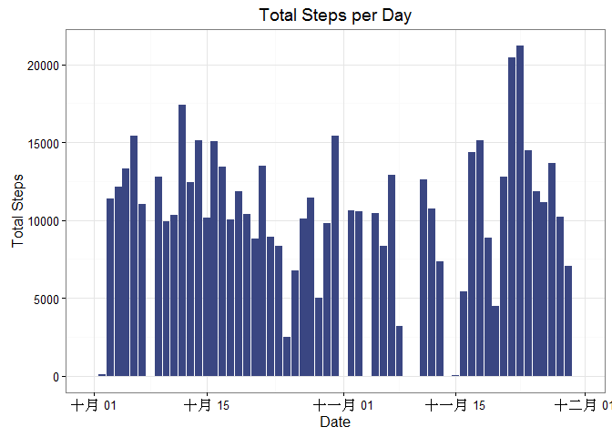
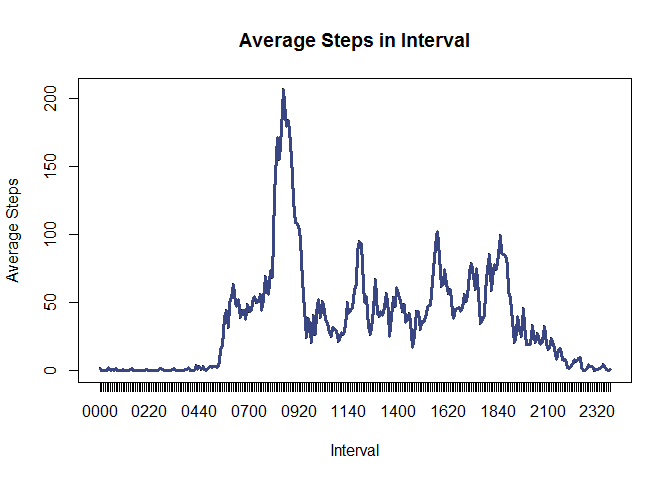
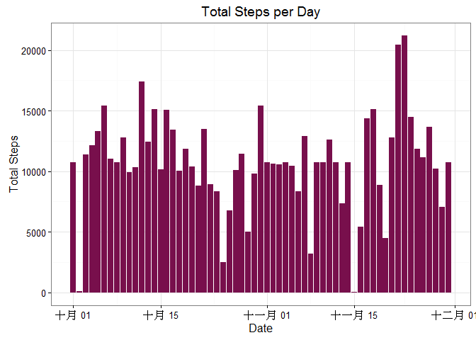
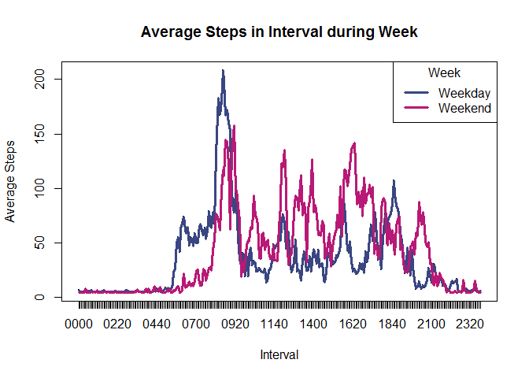

# Reproducible Research: Peer Assessment 1


## Loading and preprocessing the data

Unzip and load data

```r
setwd("C:/Users/kim001/Documents/GitHub/RepData_PeerAssessment1")
unzip("activity.zip") 
activitydata <- read.csv("activity.csv", header=T, sep = ",")
str(activitydata)
```

```
## 'data.frame':	17568 obs. of  3 variables:
##  $ steps   : int  NA NA NA NA NA NA NA NA NA NA ...
##  $ date    : Factor w/ 61 levels "2012-10-01","2012-10-02",..: 1 1 1 1 1 1 1 1 1 1 ...
##  $ interval: int  0 5 10 15 20 25 30 35 40 45 ...
```

Processing the data

```r
library(dplyr)
```

```
## 
## Attaching package: 'dplyr'
```

```
## The following objects are masked from 'package:stats':
## 
##     filter, lag
```

```
## The following objects are masked from 'package:base':
## 
##     intersect, setdiff, setequal, union
```

```r
library(lubridate)
```

```
## 
## Attaching package: 'lubridate'
```

```
## The following object is masked from 'package:base':
## 
##     date
```

```r
library(stringr)
activitydata$interval <- as.factor(str_pad(activitydata$interval,4, pad = "0"))
activitydata$date <- ymd(activitydata$date)
```

View the data

```r
str(activitydata)
```

```
## 'data.frame':	17568 obs. of  3 variables:
##  $ steps   : int  NA NA NA NA NA NA NA NA NA NA ...
##  $ date    : Date, format: "2012-10-01" "2012-10-01" ...
##  $ interval: Factor w/ 288 levels "0000","0005",..: 1 2 3 4 5 6 7 8 9 10 ...
```

## What is mean total number of steps taken per day?

1.Make a histogram of the total number of steps taken each day  

```r
stepdaysum <- activitydata %>% select(date, steps) %>% 
      group_by(date) %>% summarize(steps = sum(steps, na.rm=T))

library(ggplot2)
ggplot(stepdaysum, aes(x=date, y=steps)) +
      geom_bar(stat="identity",fill="#3a4682")+
      theme_bw()+
      labs(x="Date", y="Total Steps", title="Total Steps per Day")
```

<!-- -->

2. Calculate and report the mean and median total number of steps taken per day 

```r
mean(stepdaysum$steps)
```

```
## [1] 9354.23
```

```r
median(stepdaysum$steps)
```

```
## [1] 10395
```

## What is the average daily activity pattern?
1. Make a time series plot (i.e. type = "l") of the 5-minute interval (x-axis) and the average number of steps taken, averaged across all days (y-axis)

```r
stepinterval <- activitydata %>% group_by(interval) %>%
      summarize(steps = mean(steps, na.rm=T))

plot(stepinterval, xlab="Interval", ylab="Average Steps", 
     main="Average Steps in Interval",type="n")
lines(stepinterval,col="#3a4682",lwd=3)
```

<!-- -->

2. Which 5-minute interval, on average across all the days in the dataset, contains the maximum number of steps?

```r
stepinterval.arrange <- stepinterval %>% arrange(desc(steps))
head(stepinterval.arrange,1)
```

```
## # A tibble: 1 × 2
##   interval    steps
##     <fctr>    <dbl>
## 1     0835 206.1698
```

## Imputing missing values

1.Calculate and report the total number of missing values in the dataset (i.e. the total number of rows with NAs)

```r
sum(is.na(activitydata$steps))
```

```
## [1] 2304
```

2.Devise a strategy for filling in all of the missing values in the dataset. The strategy does not need to be sophisticated. For example, you could use the mean/median for that day, or the mean for that 5-minute interval, etc.

```r
library(mice) #Generates Multivariate Imputations by Chained Equations (MICE)
```

```
## Loading required package: Rcpp
```

```
## mice 2.25 2015-11-09
```

```r
activitydata$date <- as.factor(activitydata$date) #mice function can't munipulate the date type of data, thus covert variable date to factor
activitydata_mice <- mice(activitydata, method="mean", seed=180)
```

3.Create a new dataset that is equal to the original dataset but with the missing data filled in.

```r
activitydata_imputation <- complete(activitydata_mice,1)
sum(is.na(activitydata_imputation$steps))
```

```
## [1] 0
```

4.Make a histogram of the total number of steps taken each day 

```r
activitydata_imputation$date <- ymd(activitydata_imputation$date)
stepdaysum_imputation <- activitydata_imputation %>%
      group_by(date) %>% summarize(steps = sum(steps))

library(ggplot2)
ggplot(stepdaysum_imputation, aes(x=date, y=steps)) +
      geom_bar(stat="identity",fill="#780f4c")+
      theme_bw()+
      labs(x="Date", y="Total Steps", title="Total Steps per Day")
```

<!-- -->

4.Calculate and report the mean and median total number of steps taken per day. Do these values differ from the estimates from the first part of the assignment? What is the impact of imputing missing data on the estimates of the total daily number of steps?

```r
mean(stepdaysum_imputation$steps)
```

```
## [1] 10766.19
```

```r
median(stepdaysum_imputation$steps)
```

```
## [1] 10766.19
```
Yes, these values differ from the estimates from the first part of the assignment.  The mean and median total number of steps taken per day are greater than the first part of the assignment.

## Are there differences in activity patterns between weekdays and weekends?
For this part the weekdays() function may be of some help here. Use the dataset with the filled-in missing values for this part.

1.Create a new factor variable in the dataset with two levels -- "weekday" and "weekend" indicating whether a given date is a weekday or weekend day.

```r
stepweekday <- activitydata_imputation %>% mutate(week = weekdays(date)) 
stepweekday$week <- gsub("星期一","weekday",stepweekday$week)
stepweekday$week <- gsub("星期二","weekday",stepweekday$week)
stepweekday$week <- gsub("星期三","weekday",stepweekday$week)
stepweekday$week <- gsub("星期四","weekday",stepweekday$week)
stepweekday$week <- gsub("星期五","weekday",stepweekday$week)
stepweekday$week <- gsub("星期六","weekend",stepweekday$week)
stepweekday$week <- gsub("星期日","weekend",stepweekday$week)
head(stepweekday)
```

```
##     steps       date interval    week
## 1 37.3826 2012-10-01     0000 weekday
## 2 37.3826 2012-10-01     0005 weekday
## 3 37.3826 2012-10-01     0010 weekday
## 4 37.3826 2012-10-01     0015 weekday
## 5 37.3826 2012-10-01     0020 weekday
## 6 37.3826 2012-10-01     0025 weekday
```

2.Make a panel plot containing a time series plot (i.e. type = "l") of the 5-minute interval (x-axis) and the average number of steps taken, averaged across all weekday days or weekend days (y-axis). The plot should look something like the following, which was created using simulated data:

```r
stepweekdayinterval <- stepweekday %>% group_by(week,interval) %>%
      summarize(steps = mean(steps, na.rm=T))

with(subset(stepweekdayinterval,week == "weekday"),plot(interval,steps,
          xlab="Interval",ylab="Average Steps", 
          main="Average Steps in Interval during Week",type= "n"))
with(subset(stepweekdayinterval,week == "weekday"),
     lines(interval,steps,col="#3a4682",lwd=3))
with(subset(stepweekdayinterval,week == "weekend"),
     lines(interval,steps,col="#b91976",lwd=3))
legend("topright",c("Weekday","Weekend"),col=c("#3a4682","#b91976"),lwd=c(3,3),title="Week")
```

<!-- -->
